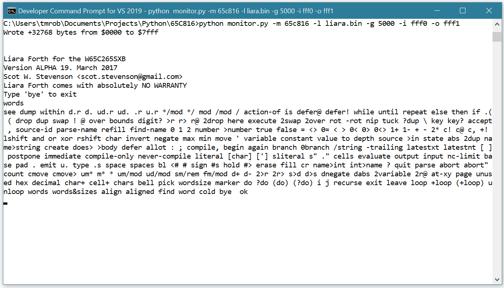

# Add support for the 65C816 to py65

Py65 (https://github.com/mnaberez/py65) is a great simulator for the 6502.  Recently I added support for interrupts (https://github.com/tmr4/py65_int) and a debug window (https://github.com/tmr4/py65_debug_window).  After success with these modifications, I decided to try adding support for the 65C816. Luckily, py65 is open-source and enhancing it isn't very difficult.

This repository provides a framework for adding support for the 65C816 to py65.  I've included the modules I've developed to simulate and test the 65C816.  As noted below, a few modifications are needed to the core py65 modules as well.

# Screenshot

# Contents

I've included the main device module, `mpu65c816.py`, to add simulation support for the 65C816 to py65.  I've also include several modules for testing the 65C816 simulation.  These include the main unit test module, `test_mpu65c816.py`, and support modules, `test_mpu65816_Common6502.py` and `test_mpu65816_Common65c02.py`, derived largely from similarly named py65 test modules, to test the 65C816 emulation mode simulation.  I've also included a binary file, `liara.bin`, that I modified from Scot W. Stevenson's Liara Forth (https://github.com/scotws/LiaraForth) to work with py65 simulating the 65C816.  Note that I'm a Python newbie and appreciate any feedback to make these better.

* `mpu65c816.py`

The 65C816 device.

* `test_mpu65c816.py`

The main unit test module for the 65C816.

* `test_mpu65816_Common6502.py`

Unit tests for 65C816 emulation mode.
  
* `test_mpu65816_Common65c02.py`

Additional 65C02 based unit tests for 65C816 emulation mode.

* `liara.bin`

A modified version of Scot W. Stevenson's Liara Forth (https://github.com/scotws/LiaraForth) for testing.  Liara Forth is designed to run on the Western Design Center's W65C265SXB development board (https://www.westerndesigncenter.com/wdc/documentation/W65C265SXB.pdf).  I've modified the Liara Forth binary to interface with alternate I/O addresses rather than those used by the development board.

# Modifications to core py65 modules

The following modifications are needed for py65 to simulate the 65C816:

1. `monitor.py`

* Add a reference to new 65C816 MPU class `from devices.mpu65c816 import MPU as CMOS65C816`
* Add the `'65C816': CMOS65C816` pair to the `Microprocessors` dictionary.

# License

The `mpu65c816.py`, `test_mpu65816_Common6502.py` and `test_mpu65816_Common65c02.py` modules contain large portions of code from or derived from py65 which is covered by a BSD 3-Clause License.  I've included that license as required.

# Running the 65C816 Unit Tests

You can run the unit tests with `python -m unittest test_mpu65c816.py`.  The 65C816 simulation passes the py65 6502- and 65C02-based test (507 in total) in emulation mode.  Some of tests were modified to run properly with the new device.  I still have to create the tests for native mode operations (not a small task).  I expect these to take some time and I expect these will turn up many errors in my code.

# Testing the 65C816 Simulation with Liara Forth

It wasn't easy to find a sizable program to test with the new 65C816 simulation.  You can run the slightly modified version of Liara Forth with `python monitor.py -m 65c816 -l liara.bin -g 5000 -i fff0 -o fff1`.

# Limitations

1. The new 65C816 device is largely untested.  I plan to update it as I work on supporting hardware and code.  Use at your own risk.  Some know issues:

* ROL and ROR haven't been updated for a 16 bit accumulator.
* Extra cycle counts haven't been considered for any new to 65816 opcodes.
* ADC and SBC in decimal mode are likely invalid in 16 bit.
* Native mode hasn't been tested outside of bank 0.  Assume it will fail for this until it is tested.  Currently only 3 banks of memory are modeled, by py65 default, but this can easily be changed.
* The simulation is meant to emulate the actual W65C816.  Modelling so far has been based on the 65816 Programming Manual only.  I intend to test at least some code against the W65C265SXB development board.
* Currently no way to break to the py65 monitor.
* Register wrapping of Direct page addressing modes need tested.

2. While Liara Forth runs in py65 with the new 65C816 device, it isn't hard to make it crash.  I believe this is due to my code, rather than Liara Forth, even though it is marked as an ALPHA version.  Liara Forth runs entirely in bank 0.  There is no way to break to the monitor since Liara Forth was designed to run on hardware only.  It can only be ended with a control-C.

3. I've successfully run a non-interrupt version of my own 6502 Forth in the new 65C816 device in emulation mode.  This isn't surprising since much of the code comes from py65 6502 and 65C02 devices.  I expect an interrupt version of it will run as well, but I haven't tested this.  I expect that many 6502 programs will run in emulation mode.  Note however, that there are differences between the 65C816 operating in emulation mode and the 6502/65C02 that could cause problems with your program.

# Status

* Initial commit: January 11, 2022
* Successfully tested my 65C02 Forth in emulation mode
* Was able to run Liara Forth in native mode in block 0.  Many words cause it to crash (likely due to one of the limitations listed above).

# Next Steps

* Resolve simulator issues with running Liara Forth.  I view this as a robust test of the 65816 simulator, other than bank switching, which Liara Forth doesn't handle out of the box.  Some hardware specific Liara Forth features will not work with the simulator (KEY? for example which is hardwired to a W65C265SXB development board specific address indicating whether a key has been pressed).
* Add native mode unit tests.
